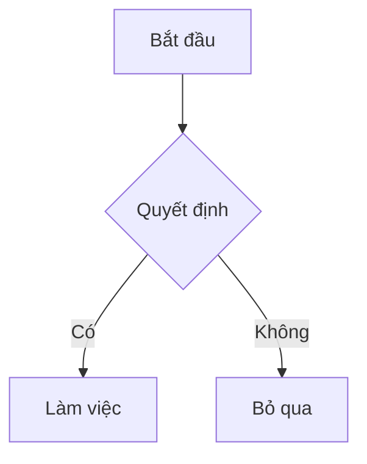
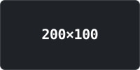

# 👋 Chào mừng đến với MDReader

MDReader là trình đọc & soạn Markdown chạy **hoàn toàn trong trình duyệt**. Không có server,
không có upload ngầm: file bạn mở, chữ bạn gõ, tất cả ở lại trên máy bạn — trừ khi chính bạn
bật đồng bộ GitHub.

> [!TIP]
> Đây chính là tài liệu bạn thấy đầu tiên khi mở MDReader — vừa là hướng dẫn sử dụng, vừa là
> bản demo sống của mọi kiểu định dạng bên dưới. Cứ để nó mở và thử từng thao tác trong khi
> đọc. Muốn dọn đi? Mở menu **⋯** trên hàng của nó rồi chọn *Close file*.

## 🚀 Đưa tài liệu vào MDReader

Có **bốn** cách:

1. **Nút "Open"** trên thanh công cụ — nếu trình duyệt hỗ trợ File System Access API
   (Chrome, Edge...), file mở dạng **live**: MDReader giữ tham chiếu tới file thật và đọc
   lại được để bắt thay đổi từ bên ngoài. Trình duyệt khác (Firefox, Safari...) tự chuyển
   sang hộp thoại chọn file thường.
2. **Kéo-thả** file vào bất kỳ đâu trên cửa sổ — màn hình sẽ hiện lớp phủ *"Drop to open"*.
   Luôn ra dạng **snapshot**, vì thao tác kéo-thả không cấp được handle file thật.
3. **Tạo mới ngay trong app** — bấm nút **➕** ở đầu sidebar → **New file**, gõ tên, Enter.
   Bạn có một tài liệu trắng để viết ngay, không cần file sẵn trên máy.
4. **Tải về từ GitHub** — xem mục đồng bộ bên dưới.

<blockquote alt="warn">

**Điều quan trọng nhất cần nhớ:** dù mở live hay snapshot, MDReader **không bao giờ ghi
ngược chỉnh sửa ra file gốc trên đĩa**. "Live" chỉ nghĩa là *đọc lại được*. Mọi thay đổi bạn
gõ vào chỉ nằm trong bộ nhớ trình duyệt (IndexedDB) — muốn có bản sao ngoài máy, hãy bật
đồng bộ GitHub Gist.

</blockquote>

Mỗi hàng file trong sidebar mang một huy hiệu trạng thái:

| Trạng thái | Ý nghĩa |
| --- | --- |
| Live (đã cấp quyền) | Đọc lại được từ đĩa để phát hiện thay đổi bên ngoài |
| Live (cần xin quyền) | Trình duyệt đã quên quyền — dùng **Grant access** để cấp lại |
| Live (bị từ chối) | Chỉ còn bản sao trong bộ nhớ, không đọc lại được từ đĩa |
| Snapshot | Không thể mở lại từ đĩa, chỉ sống trong trình duyệt |

Khi một file cần cấp lại quyền, một dải thông báo hiện ngay trên nội dung với nút
**Grant access** — hoặc bấm **×** để tạm ẩn nếu bạn chỉ muốn đọc bản đã lưu.

## 📁 Quản lý thư viện

### Thư mục

Bấm **➕ → New folder** để tạo, rồi:

- **Kéo file** vào tiêu đề thư mục (desktop), hoặc dùng menu **⋯ → Move to** trên hàng file
  (cách duy nhất trên thiết bị cảm ứng, vì màn cảm ứng không sinh sự kiện kéo).
- Chọn một thư mục để file mới mở/tạo tự động rơi vào đó.
- **⋯ → Rename** để đổi tên, bấm mũi tên để thu gọn.
- **Remove folder, keep files** — xoá thư mục, file trở về danh sách phẳng (an toàn).
- **Delete folder and files** — xoá cả file bên trong (có hỏi xác nhận).

### Menu ⋯ trên từng file

| Mục | Tác dụng |
| --- | --- |
| Grant access | Xin lại quyền đọc file live |
| Sync to GitHub / Sync now / Pull... | Các thao tác đồng bộ, tuỳ trạng thái |
| Move to → *tên thư mục* | Xếp file vào thư mục |
| Remove from folder | Đưa file ra khỏi thư mục |
| Close file | Đóng file khỏi thư viện |

### Dung lượng lưu trữ

Cuối sidebar là thanh đo dung lượng đã dùng trên tổng hạn mức trình duyệt cấp. Khi gần đầy,
MDReader cảnh báo **"Storage almost full — close a few snapshots."**; khi vượt hạn mức, file
mới vẫn mở được nhưng **không lưu lại cho lần sau**, và hàng file đó mang dấu *"Not saved —
storage is full"*. Nút **Clear all** dọn sạch thư viện.

## ☁️ Đồng bộ qua GitHub Gist

Muốn đọc ghi chú trên nhiều máy? Bấm nút tài khoản (góc phải thanh công cụ, hiện logo GitHub
khi chưa đăng nhập, hiện avatar khi đã đăng nhập) → đăng nhập GitHub. Sau đó bật đồng bộ
**cho từng file** qua menu **⋯ → Sync to GitHub**.

<blockquote alt="danger">

**Đọc kỹ trước khi bật:** file được đưa lên dưới dạng **secret gist** — đây là *unlisted*,
**không phải private**. Bất kỳ ai có đường link đều đọc được, và bạn không thể thu hồi quyền
của riêng một người; cách duy nhất là xoá gist. Đừng đồng bộ tài liệu nhạy cảm.

</blockquote>

Vài điều cần biết:

- **Giới hạn 1MB** mỗi file. File lớn hơn vẫn mở và đọc bình thường, chỉ là không đồng bộ được.
- **Ctrl/Cmd+S** vừa lưu xuống bộ nhớ cục bộ, vừa đẩy lên gist nếu file đang bật đồng bộ.
  MDReader **cố tình không tự đẩy theo thời gian** — mỗi lần đẩy tạo một revision mới trên gist.
- Gist Markdown có sẵn trên tài khoản mà máy này chưa có sẽ hiện ở mục **"On GitHub"** cuối
  sidebar (viền đứt nét). Bấm vào để tải nội dung về — trước đó app chưa tải một byte nào.
- Tắt đồng bộ chỉ gỡ liên kết ở máy này; bản trên GitHub vẫn còn cho tới khi bạn chọn
  **Delete copy from GitHub**.

### Biểu tượng trạng thái đồng bộ

| Trạng thái | Ý nghĩa | Việc cần làm |
| --- | --- | --- |
| ✓ Khớp | Bản ở đây trùng bản trên GitHub | Không cần gì |
| ↑ Có sửa mới | Đã sửa từ lần đồng bộ trước | **Sync now** hoặc Ctrl/Cmd+S |
| ↓ Bản mới trên GitHub | Máy khác vừa đẩy lên | **Pull** — không mất gì vì bạn chưa sửa |
| ⚠ Xung đột | Sửa ở cả hai nơi | Chọn cách xử lý ở dải cảnh báo trên tài liệu |
| ⚠ Gist đã bị xoá | Bản trên GitHub bị xoá từ máy khác | **Upload to GitHub again** |
| ⚠ Lỗi | Đồng bộ thất bại | **Retry sync** trong menu ⋯ |
| ⚠ Quá lớn | Vượt mốc 1MB | Không đồng bộ được |

### Khi xảy ra xung đột

MDReader **không bao giờ tự động giải quyết** — cả hai bản đều là công sức của bạn. Một dải
đỏ hiện trên tài liệu với ba lựa chọn:

- **Keep both** *(khuyến nghị)* — kéo bản GitHub về thành một file riêng, bản hiện tại giữ
  nguyên. Không mất gì cả.
- **Keep mine** — đẩy bản này đè lên GitHub (bản cũ vẫn nằm trong lịch sử gist).
- **Take GitHub's** — thay bản này bằng bản từ GitHub, **chỉnh sửa cục bộ bị bỏ**.

## ✏️ Soạn thảo

Bấm nút **Edit** (hoặc **Ctrl/Cmd+E**) để mở khung soạn thảo song song với bản xem trước.

- **Tự lưu** vào bộ nhớ trình duyệt sau ~1 giây ngừng gõ, và ngay lập tức khi bạn chuyển tab,
  ẩn cửa sổ hoặc nhấn Ctrl/Cmd+S. Huy hiệu **"edited"** cạnh tên file cho biết còn thay đổi
  chưa lưu.
- Phím **Tab** chèn 2 dấu cách thay vì nhảy khỏi ô.
- **Kéo đường phân cách** giữa hai khung để chỉnh độ rộng (220–760px).
- Nút **Revert** huỷ mọi chỉnh sửa, quay về nội dung đọc lần cuối từ đĩa (hoặc lần pull gist
  gần nhất).
- Trên mobile, khung soạn thảo và bản xem trước chuyển thành hai tab **Source / Preview**.
- Ctrl/Cmd+S **không** ghi ra file gốc trên đĩa — chỉ lưu cục bộ và đẩy gist (nếu bật).

## 🎨 Giao diện

Nhấn **Ctrl/Cmd+K** (hoặc nút Settings → **Theme**) để mở bảng chọn theme:

- Ô tìm kiếm, bộ lọc **All / Light / Dark**, xem trước bốn màu chủ đạo ngay trên từng dòng.
- Di chuyển bằng phím **↑ ↓** rồi **Enter**, **Esc** để đóng.
- **Import theme…** nạp file JSON theme tự thiết kế; **Export current** tải theme đang dùng về.

**17 theme dựng sẵn**: GitHub Light, Night Owl, Sepia Book, Azure Corporate, Midnight Cobalt,
Rose Quartz, Konayuki Light, Konayuki Dark, Phycat Vampire, Phycat Radiation, Phycat Abyss,
Phycat Caramel, Phycat Mauve, Punch Card, Blueprint, Swiss Poster, Signal Loss.

Bốn cái cuối đi theo hướng ngược lại với phần còn lại: thay vì port một theme editor có sẵn,
mỗi cái dựng quanh một kiểu hoa văn có khả năng **đổi hình khối** của giao diện — thẻ đục lỗ
bị cắt góc, bản vẽ kỹ thuật với nét đứt và chú thích kích thước, poster Thuỵ Sĩ đảo nền/hình,
và băng từ đọc qua đầu từ hỏng.

Theme ở MDReader không chỉ là bảng màu — nó còn quyết định **hoa văn trang trí** trên thanh
công cụ và sidebar, **ký hiệu đầu đề** (chevron / wedge / ẩn hẳn), cỡ chữ từng cấp tiêu đề,
độ rộng cột chữ và font chữ. Muốn tuỳ chỉnh sâu, xem [authoring-themes.md](authoring-themes.md).

## ⌨️ Phím tắt

| Phím | Chức năng |
| --- | --- |
| `Ctrl/Cmd + E` | Bật/tắt khung soạn thảo |
| `Ctrl/Cmd + \` | Ẩn/hiện sidebar |
| `Ctrl/Cmd + K` | Mở bảng chọn theme |
| `Ctrl/Cmd + S` | Lưu (và đồng bộ nếu đang bật) |

> [!NOTE]
> Bảng phím tắt này cũng nằm sẵn trong panel **Settings** — bấm nút tài khoản ở góc phải
> thanh công cụ, các phím hiển thị đúng theo hệ điều hành bạn đang dùng (⌘ trên macOS,
> Ctrl trên Windows/Linux).

## 🧭 Đọc và điều hướng

- **Mục lục** bên phải (desktop) tự bám theo vị trí đọc; bấm để nhảy tới mục. Trên mobile nó
  thu thành menu **"On this page"** trong thanh phụ.
- **Thanh tiến trình** mỏng dưới toolbar cho biết đã đọc tới đâu.
- **Vị trí cuộn của từng file** được nhớ cho lần mở sau.
- Tài liệu lớn hiện khung xương chờ (kèm dung lượng) trong lúc dựng nội dung.
- Bấm **Ctrl/Cmd+\** hoặc nút góc phải để ẩn sidebar, lấy trọn màn hình cho việc đọc.

## 📝 Markdown được hỗ trợ

MDReader dựng theo chuẩn **GitHub Flavored Markdown**, cộng thêm:

- **Code block** có nhãn ngôn ngữ và nút **Copy** (hiện khi rê chuột) — tô màu theo 12 token
  màu riêng cho từng theme.
- **Sơ đồ Mermaid** và **công thức KaTeX** (`$$…$$`) — chỉ tải thư viện khi tài liệu thật sự
  cần, nên tài liệu thường không phải tải thêm gì.
- **Callout** năm loại, viết theo hai cú pháp.
- **HTML an toàn**: `<kbd>`, `<mark>`, `<details>` hoạt động; script và style bị loại bỏ.
- **Bảng thông minh**: cột số tự căn phải, tiêu đề bảng dài tự dính, bảng rộng cuộn riêng.

### Năm loại callout

Viết theo cú pháp marker của GitHub, hoặc bằng thuộc tính `alt` khi dòng marker bất tiện:

| Marker | `alt=` tương đương | Dùng khi |
| --- | --- | --- |
| `[!NOTE]` | `info`, `note` | Thông tin cần chú ý |
| `[!TIP]` | `success`, `tip` | Mẹo, điều nên làm |
| `[!IMPORTANT]` | `important` | Điều không được bỏ qua |
| `[!WARNING]` | `warn`, `warning` | Cần cẩn thận |
| `[!CAUTION]` | `danger`, `caution` | Nguy hiểm, có thể mất dữ liệu |

---

# 🧪 Khu vực thử nghiệm hiển thị

Phần dưới đây trình diễn mọi kiểu định dạng Markdown mà MDReader hỗ trợ — vừa để bạn khám
phá cú pháp, vừa là bộ ảnh QA nội bộ.

## Định dạng chữ

Chữ thường với **đậm**, *nghiêng*, ~~gạch ngang~~, `code nội dòng`, và một
[liên kết](https://example.com). Đây là chú thích cuối trang[^1].

## Các cấp tiêu đề

### Tiêu đề H3
#### Tiêu đề H4
##### Tiêu đề H5
###### Tiêu đề H6

## Danh sách

- Mục không thứ tự một
- Mục không thứ tự hai
  - Mục con hình tròn
    - Mục cháu hình vuông

1. Mục có thứ tự một
2. Mục có thứ tự hai
   1. Mục con chữ thường
      1. Mục cháu số La Mã

- [x] Việc đã xong
- [ ] Việc chưa làm
  - [x] Việc con đã xong
  - [ ] Việc con chưa làm

## Trích dẫn

> Một đoạn trích dẫn trải dài
> qua nhiều dòng, để kiểm tra nền và viền của khối quote.

## Callout (hộp ghi chú)

Cú pháp marker kiểu GitHub:

> [!NOTE]
> Thông tin hữu ích mà người đọc nên chú ý.

> [!IMPORTANT]
> Điều không được bỏ qua.

> [!WARNING]
> Điều gì đó cần cẩn thận.

Cùng những hộp đó viết bằng thuộc tính `alt`, tiện khi dòng marker không phù hợp:

<blockquote alt="info">

Hộp `info`, tương đương `[!NOTE]`.

</blockquote>

<blockquote alt="success">

Hộp `success`, tương đương `[!TIP]`.

</blockquote>

<blockquote alt="important">

Hộp `important`, tương đương `[!IMPORTANT]`.

</blockquote>

<blockquote alt="danger">

Hộp `danger`, tương đương `[!CAUTION]`.

</blockquote>

## Mã nguồn

Code nội dòng `const x = 1`, và các khối mã theo nhiều ngôn ngữ — cùng nhau kiểm tra đủ
mười hai token màu `--syn-*`.

```js
// Comment: strings, numbers, template substitution
import { readFile } from 'node:fs/promises';

export class Greeter {
  #count = 0;

  async greet(name = 'world') {
    this.#count += 1;
    return `Hello, ${name}! (${this.#count})`;
  }
}

const re = /^[a-z]+$/i;
export default new Greeter();
```

```python
from dataclasses import dataclass

@dataclass
class Point:
    """A point in 2D space."""
    x: float = 0.0
    y: float = 0.0

    def norm(self) -> float:
        return (self.x ** 2 + self.y ** 2) ** 0.5

if __name__ == "__main__":
    print(Point(3, 4).norm())  # 5.0
```

```css
:root {
  --accent: #0969da;
}

article a:hover,
.callout::before {
  color: var(--accent);
  text-decoration: underline;
}
```

```html
<section class="wrapper" data-role="main">
  <!-- an HTML comment -->
  <h1 id="title">Hello</h1>
  <input type="text" disabled />
</section>
```

```bash
#!/usr/bin/env bash
set -euo pipefail

for f in *.md; do
  echo "processing ${f}"   # $$ here is a shell PID, not math
done
```

```json
{
  "name": "md-reader",
  "private": true,
  "version": "0.0.0",
  "scripts": { "dev": "vite" }
}
```

Khối mã không gắn ngôn ngữ sẽ không tô màu, vì đoán sai ngôn ngữ còn tệ hơn không đoán:

```
Just some plain text.
No language tag, so no coloring.
```

## Công thức toán

Công thức khối dùng `$$…$$`. KaTeX chỉ tải khi tài liệu thật sự chứa công thức.

$$
\int_0^1 x^2 \, dx = \frac{1}{3}
$$

Chèn giữa câu: $$e^{i\pi} + 1 = 0$$ — hằng đẳng thức Euler.

Một công thức rộng, để kiểm tra nó tự cuộn trong khối riêng thay vì kéo giãn cả bài viết:

$$
\hat{f}(\xi) = \int_{-\infty}^{\infty} f(x)\, e^{-2\pi i x \xi}\, dx \quad\text{where}\quad \xi \in \mathbb{R}
$$

Dấu đô-la đơn thì được giữ nguyên là văn bản, ví dụ giá $5 và $10.

## HTML nội dòng

Nhấn <kbd>Ctrl</kbd> + <kbd>P</kbd> để in, và <mark>đánh dấu highlight</mark> cho một
đoạn văn.

<details>
<summary>Một mục có thể thu gọn</summary>

Ẩn cho đến khi mở ra — hữu ích cho các phụ lục dài.

</details>

## Sơ đồ Mermaid



### Mermaid không hợp lệ (trạng thái lỗi)

```mermaid
not a real diagram type
some nonsense
```

## Bảng biểu

Một bảng văn xuôi — ô tự xuống dòng thay vì bị ép nằm một hàng, các hàng chẵn có màu nền
xen kẽ. Rê chuột vào một hàng để thấy `--table-row-hover`:

| Tính năng | Mô tả |
| --- | --- |
| Cú pháp nổi bật | Tô màu mã nguồn theo từng ngôn ngữ, dùng mười hai token màu riêng biệt |
| Công thức toán | Dựng bằng KaTeX, chỉ tải khi tài liệu thật sự có công thức |
| Callout | Hai cú pháp, cùng một kiểu hiển thị |

### Cột số tự căn lề

Không có dòng căn lề nào được viết bên dưới, nhưng cột số vẫn tự căn phải trong khi cột
văn xuôi thì không. Chữ số thẳng hàng theo hàng đơn vị, nên có thể quét mắt thay vì đọc
từng ô — để ý `9` nằm dưới hàng đơn vị của `1.204`:

| Gói | Số bản ghi | Dung lượng | Thay đổi | Ghi chú |
| --- | --- | --- | --- | --- |
| Alpha | 1,204 | 12.5% | +3.4 | Ổn định qua hai kỳ |
| Bravo | 87 | 4.02% | −0.5 | Giảm nhẹ so với quý trước |
| Charlie | 9 | 0.31% | +12.75 | Mới thêm trong tháng này |
| Delta | 26,530 | 61.7% | −8.2 | Chiếm phần lớn dung lượng |

Số tiền, số âm trong ngoặc, và ô để trống vẫn nằm đúng cột — ô trống hoặc `—` không mang
giá trị, nên không tính là văn xuôi cũng không phá vỡ việc căn lề:

| Hạng mục | Chi phí | Chênh lệch |
| --- | --- | --- |
| Hạ tầng | $1,299 | (240.50) |
| Giấy phép | $99 | — |
| Đào tạo | $12,400 | (1,020) |
| Dự phòng | | 0 |

Một cột chỉ căn phải khi *mọi* ô không trống đều đọc như một con số. Chỉ cần một ô văn
xuôi là cả cột bị loại, đó là lý do vì sao `Số liệu` bên dưới vẫn căn trái dù hai trong ba
ô là số:

| Khu vực | Số liệu |
| --- | --- |
| Miền Bắc | 1,204 |
| Miền Trung | 87 |
| Miền Nam | chưa có số liệu |

Văn xuôi chỉ *bắt đầu* bằng chữ số thì không được tính là số, nên cột này không bị căn lại:

| Mục | Trạng thái |
| --- | --- |
| Alpha | 3 vấn đề còn lại |
| Bravo | 2024 in review |
| Charlie | 10 GB nhật ký |

### Căn lề tường minh luôn thắng

Người viết đã tự trả lời câu hỏi khi viết dòng phân cách, nên `:---:` ở đây thắng cơ chế tự
động — các con số được căn giữa dù đọc như một cột số:

| Trái | Giữa | Phải |
| :--- | :---: | ---: |
| Alpha | 1,204 | 1,204 |
| Bravo | 87 | 87 |
| Charlie | 9 | 9 |

### Bảng rộng

Kiểm tra cuộn ngang, hiệu ứng mờ dần ở mép, và khung bo góc cắt đúng góc vuông của bảng:

| Column Alpha | Column Bravo | Column Charlie | Column Delta | Column Echo | Column Foxtrot | Column Golf | Column Hotel |
| --- | --- | --- | --- | --- | --- | --- | --- |
| Row one alpha value | Row one bravo value | Row one charlie value | Row one delta value | Row one echo value | Row one foxtrot value | Row one golf value | Row one hotel value |
| Row two alpha value | Row two bravo value | Row two charlie value | Row two delta value | Row two echo value | Row two foxtrot value | Row two golf value | Row two hotel value |

### Bảng dài

Đủ dài để tự cuộn trong khung riêng — cuộn khối này và dòng tiêu đề vẫn đứng yên:

| # | Mã | Tên mục | Giá trị |
| --- | --- | --- | --- |
| 1 | A-001 | Mục thứ nhất | 1,204 |
| 2 | A-002 | Mục thứ hai | 87 |
| 3 | A-003 | Mục thứ ba | 9 |
| 4 | A-004 | Mục thứ tư | 26,530 |
| 5 | A-005 | Mục thứ năm | 412 |
| 6 | A-006 | Mục thứ sáu | 3,908 |
| 7 | A-007 | Mục thứ bảy | 55 |
| 8 | A-008 | Mục thứ tám | 17,640 |
| 9 | A-009 | Mục thứ chín | 231 |
| 10 | A-010 | Mục thứ mười | 6,015 |
| 11 | A-011 | Mục mười một | 78 |
| 12 | A-012 | Mục mười hai | 2,344 |
| 13 | A-013 | Mục mười ba | 190 |
| 14 | A-014 | Mục mười bốn | 8,721 |
| 15 | A-015 | Mục mười lăm | 76 |
| 16 | A-016 | Mục mười sáu | 5,334 |
| 17 | A-017 | Mục mười bảy | 1,230 |
| 18 | A-018 | Mục mười tám | 567 |
| 19 | A-019 | Mục mười chín | 987 |
| 20 | A-020 | Mục hai mươi | 1 |

### Ô nội dung phong phú

Định dạng nội dòng, mã, liên kết và công thức đều sống sót bên trong ô bảng:

| Kiểu | Ví dụ | Ghi chú |
| --- | --- | --- |
| Đậm & nghiêng | **đậm**, *nghiêng*, ~~gạch~~ | Cùng một ô |
| Mã | `const x = 1` | Nền mã trong ô |
| Liên kết | [example.com](https://example.com) | Màu `--link` |
| Công thức | $$a^2 + b^2 = c^2$$ | KaTeX trong ô |

## Hình ảnh

Một ảnh hoạt động bình thường:



Một ảnh lỗi (URL sai, kiểm tra trạng thái dự phòng):


## Đường kẻ ngang

---

## Font tiếng Việt

Đoạn văn này dùng để kiểm tra cách font hiển thị tiếng Việt: dấu thanh chồng lên nguyên âm
đã có dấu phụ, những chữ dễ vỡ nét như **ữ**, **ỡ**, **ặ**, **ội**, **ườ**, và các chữ hoa
mang dấu như **Ổ**, **Ẫ**, **Ợ**. Nếu font thiếu glyph, chúng sẽ tụt dòng hoặc rơi về một
font dự phòng trông lệch hẳn so với phần chữ xung quanh.

> [!TIP]
> Tiêu đề tiếng Việt vẫn tạo được liên kết neo đúng — mục lục bên phải trỏ tới
> `#font-tiếng-việt`, giữ nguyên dấu thay vì lược bỏ thành `font-ting-vit`.

Một câu dài không có chỗ ngắt hợp lệ, ví dụ đường dẫn
`https://example.com/tài-liệu/hướng-dẫn-cài-đặt-môi-trường-phát-triển`, sẽ tự xuống dòng
thay vì đẩy cả bài viết trượt ngang.

## Chú thích cuối trang

[^1]: Đây là nội dung chú thích, có liên kết quay lại phần tham chiếu phía trên.
