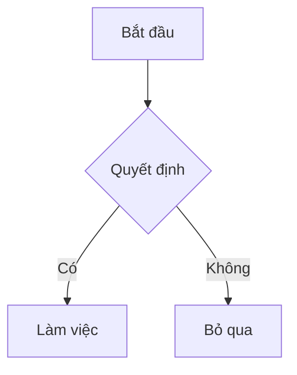

# 👋 Chào mừng đến với MDReader

MDReader là trình đọc Markdown chạy **hoàn toàn trong trình duyệt** — không server, không
upload. File bạn mở, dữ liệu bạn sửa, tất cả ở lại trên máy bạn.

> [!TIP]
> Đây chính là tài liệu bạn nhìn thấy đầu tiên khi mở MDReader lần đầu — nó vừa là hướng
> dẫn sử dụng, vừa là bản demo sống của mọi tính năng render bên dưới. Cứ để nó mở và thử
> từng phần trong khi đọc!

## 🚀 Bắt đầu: mở file của bạn

Có ba cách để đưa Markdown vào MDReader:

1. **Nút "Open" trên thanh công cụ** — nếu trình duyệt hỗ trợ File System Access API
   (Chrome, Edge...), file được mở **"live"**: MDReader giữ một tham chiếu tới file thật,
   đọc lại được để phát hiện thay đổi từ bên ngoài, và nhớ quyền truy cập cho lần sau.
2. **Kéo-thả file** vào bất kỳ đâu trên cửa sổ — luôn mở dưới dạng **"snapshot"** (ảnh chụp
   một lần), vì thao tác kéo-thả không bao giờ cấp được handle file thật.
3. **Trình duyệt không hỗ trợ File System Access API** (Firefox, Safari...)? Nút Open sẽ
   tự chuyển sang hộp thoại chọn file thông thường — cũng cho ra snapshot.

<blockquote alt="warn">

**Ghi nhớ:** dù mở live hay snapshot, MDReader **không bao giờ ghi ngược chỉnh sửa ra file
gốc trên đĩa**. "Live" chỉ nghĩa là đọc lại được (re-readable) — mọi thay đổi bạn gõ vào chỉ
tồn tại trong bộ nhớ trình duyệt (IndexedDB), trừ khi bạn bật đồng bộ GitHub Gist (xem bên
dưới) để có thêm một bản sao trên GitHub.

</blockquote>

Ở thanh bên (sidebar), mỗi file hiện một huy hiệu trạng thái:

| Trạng thái | Ý nghĩa |
| --- | --- |
| Live (đã cấp quyền) | Đọc lại được từ đĩa để phát hiện thay đổi bên ngoài |
| Live (cần xin quyền) | Có nút **Grant access** để cấp lại quyền đọc |
| Live (bị từ chối) | Chỉ còn bản sao trong bộ nhớ, không đọc lại được từ đĩa |
| Snapshot | Không thể mở lại từ đĩa, chỉ sống trong trình duyệt |

## 📁 Sắp xếp bằng thư mục

Quá nhiều file trong danh sách? Tạo **thư mục** ngay trong sidebar (mục "New folder"), rồi:

- Kéo file vào tiêu đề thư mục để xếp vào (trên desktop); trên thiết bị cảm ứng, dùng menu
  **"Move to…"** thay cho kéo-thả.
- Chọn một thư mục để file mới mở/tạo tự động rơi vào đó.
- Thu gọn thư mục khi không cần xem, hoặc **ungroup** để trả file về danh sách phẳng (không
  mất dữ liệu).
- Xoá thư mục sẽ xoá luôn mọi file bên trong — MDReader sẽ hỏi xác nhận trước khi làm.

## ☁️ Đồng bộ qua GitHub Gist

Muốn truy cập ghi chú từ nhiều máy? Đăng nhập GitHub (nút tài khoản trong menu **⋯**), rồi
bật công tắc đồng bộ trên từng file riêng lẻ — đồng bộ là **tuỳ chọn theo từng file**, không
có gì được đẩy lên nếu bạn không bật.

- File đã đồng bộ được lưu thành một **secret gist** trên tài khoản của bạn.
- Nhấn **Ctrl/Cmd+S** để lưu — thao tác này vừa ghi xuống bộ nhớ cục bộ, vừa đẩy lên gist
  nếu file đang bật đồng bộ. MDReader **không tự động đẩy theo thời gian**, vì mỗi lần đẩy
  tạo một revision mới trên gist.
- Các gist Markdown có sẵn trên tài khoản nhưng chưa có ở máy này sẽ hiện trong mục
  **"On GitHub"** — bấm vào để tải về như một file mới.
- Khi có xung đột (sửa cả hai nơi), MDReader cho bạn chọn: **giữ bản của tôi**, **lấy bản
  từ xa**, hoặc **giữ cả hai**.

## 🎨 Đổi giao diện

Nhấn **Ctrl/Cmd+K** (hoặc menu **⋯ → Theme**) để mở bảng chọn theme: tìm kiếm, lọc theo
Sáng/Tối, xem trước màu trực tiếp trước khi chọn.

MDReader đi kèm **13 theme dựng sẵn** — từ GitHub Light quen thuộc, Night Owl cho dân code
đêm khuya, đến các bộ màu nghệ hơn như Konayuki, Phycat Vampire hay Rose Quartz. Không thích
theme nào có sẵn? Dùng **Import theme…** để nạp file JSON theme tự thiết kế (xem
[authoring-themes.md](authoring-themes.md) để biết cách tạo), hoặc **Export current** để
tải theme đang dùng về máy.

## ✏️ Chỉnh sửa & khôi phục

Nhấn nút Edit (hoặc **Ctrl/Cmd+E**) để mở khung soạn thảo song song với bản xem trước. Mọi
chỉnh sửa:

- Tự lưu vào bộ nhớ trình duyệt sau ~1 giây ngừng gõ (hoặc ngay lập tức khi bạn rời khỏi
  tab, ẩn cửa sổ, hoặc nhấn Ctrl/Cmd+S).
- **Không bao giờ** ghi ngược ra file gốc trên đĩa — kể cả file live. Ctrl/Cmd+S chỉ lưu
  vào IndexedDB (và đẩy lên gist nếu file đang bật đồng bộ), file thật trên máy bạn không
  hề bị đụng tới.
- Có thể huỷ bỏ bất cứ lúc nào bằng nút **Revert**, quay về đúng nội dung đã đọc lần cuối
  từ đĩa (hoặc từ lần pull gist gần nhất).

## ⌨️ Phím tắt cần nhớ

| Phím | Chức năng |
| --- | --- |
| `Ctrl/Cmd + E` | Bật/tắt khung soạn thảo |
| `Ctrl/Cmd + \` | Ẩn/hiện sidebar |
| `Ctrl/Cmd + K` | Mở bảng chọn theme |
| `Ctrl/Cmd + S` | Lưu (và đồng bộ nếu đang bật) |

## 🧭 Mục lục & tiến trình đọc

Bên phải màn hình (desktop) là mục lục tự cuộn theo vị trí đọc — bấm vào một mục để nhảy
thẳng tới đó. Trên mobile, mục lục thu gọn thành một menu sổ xuống trong thanh phụ. Thanh
tiến trình mỏng ngay dưới toolbar cho biết bạn đã đọc tới đâu, và MDReader còn nhớ vị trí
cuộn của từng file cho lần mở sau.

---

# 🧪 Khu vực thử nghiệm hiển thị

Phần dưới đây trình diễn mọi kiểu định dạng Markdown mà MDReader hỗ trợ — vừa để bạn khám
phá cú pháp, vừa là bộ ảnh QA nội bộ.

## Định dạng chữ

Chữ thường với **đậm**, *nghiêng*, ~~gạch ngang~~, `code nội dòng`, và một
[liên kết](https://example.com). Đây là chú thích cuối trang[^1].

## Các cấp tiêu đề

### Tiêu đề H3
#### Tiêu đề H4
##### Tiêu đề H5
###### Tiêu đề H6

## Danh sách

- Mục không thứ tự một
- Mục không thứ tự hai
  - Mục con hình tròn
    - Mục cháu hình vuông

1. Mục có thứ tự một
2. Mục có thứ tự hai
   1. Mục con chữ thường
      1. Mục cháu số La Mã

- [x] Việc đã xong
- [ ] Việc chưa làm
  - [x] Việc con đã xong
  - [ ] Việc con chưa làm

## Trích dẫn

> Một đoạn trích dẫn trải dài
> qua nhiều dòng, để kiểm tra nền và viền của khối quote.

## Callout (hộp ghi chú)

Cú pháp marker kiểu GitHub:

> [!NOTE]
> Thông tin hữu ích mà người đọc nên chú ý.

> [!WARNING]
> Điều gì đó cần cẩn thận.

Cùng những hộp đó viết bằng thuộc tính `alt`, tiện khi dòng marker không phù hợp:

<blockquote alt="info">

Hộp `info`, tương đương `[!NOTE]`.

</blockquote>

<blockquote alt="success">

Hộp `success`, tương đương `[!TIP]`.

</blockquote>

<blockquote alt="danger">

Hộp `danger`, tương đương `[!CAUTION]`.

</blockquote>

## Mã nguồn

Code nội dòng `const x = 1`, và các khối mã theo nhiều ngôn ngữ — cùng nhau kiểm tra đủ
mười hai token màu `--syn-*`.

```js
// Comment: strings, numbers, template substitution
import { readFile } from 'node:fs/promises';

export class Greeter {
  #count = 0;

  async greet(name = 'world') {
    this.#count += 1;
    return `Hello, ${name}! (${this.#count})`;
  }
}

const re = /^[a-z]+$/i;
export default new Greeter();
```

```python
from dataclasses import dataclass

@dataclass
class Point:
    """A point in 2D space."""
    x: float = 0.0
    y: float = 0.0

    def norm(self) -> float:
        return (self.x ** 2 + self.y ** 2) ** 0.5

if __name__ == "__main__":
    print(Point(3, 4).norm())  # 5.0
```

```css
:root {
  --accent: #0969da;
}

article a:hover,
.callout::before {
  color: var(--accent);
  text-decoration: underline;
}
```

```html
<section class="wrapper" data-role="main">
  <!-- an HTML comment -->
  <h1 id="title">Hello</h1>
  <input type="text" disabled />
</section>
```

```bash
#!/usr/bin/env bash
set -euo pipefail

for f in *.md; do
  echo "processing ${f}"   # $$ here is a shell PID, not math
done
```

```json
{
  "name": "md-reader",
  "private": true,
  "version": "0.0.0",
  "scripts": { "dev": "vite" }
}
```

Khối mã không gắn ngôn ngữ sẽ không tô màu, vì đoán sai ngôn ngữ còn tệ hơn không đoán:

```
Just some plain text.
No language tag, so no coloring.
```

## Công thức toán

Công thức khối dùng `$$…$$`. KaTeX chỉ tải khi tài liệu thật sự chứa công thức.

$$
\int_0^1 x^2 \, dx = \frac{1}{3}
$$

Chèn giữa câu: $$e^{i\pi} + 1 = 0$$ — hằng đẳng thức Euler.

Một công thức rộng, để kiểm tra nó tự cuộn trong khối riêng thay vì kéo giãn cả bài viết:

$$
\hat{f}(\xi) = \int_{-\infty}^{\infty} f(x)\, e^{-2\pi i x \xi}\, dx \quad\text{where}\quad \xi \in \mathbb{R}
$$

Dấu đô-la đơn thì được giữ nguyên là văn bản, ví dụ giá $5 và $10.

## HTML nội dòng

Nhấn <kbd>Ctrl</kbd> + <kbd>P</kbd> để in, và <mark>đánh dấu highlight</mark> cho một
đoạn văn.

<details>
<summary>Một mục có thể thu gọn</summary>

Ẩn cho đến khi mở ra — hữu ích cho các phụ lục dài.

</details>

## Sơ đồ Mermaid



### Mermaid không hợp lệ (trạng thái lỗi)

```mermaid
not a real diagram type
some nonsense
```

## Bảng biểu

Một bảng văn xuôi — ô tự xuống dòng thay vì bị ép nằm một hàng, các hàng chẵn có màu nền
xen kẽ. Rê chuột vào một hàng để thấy `--table-row-hover`:

| Tính năng | Mô tả |
| --- | --- |
| Cú pháp nổi bật | Tô màu mã nguồn theo từng ngôn ngữ, dùng mười hai token màu riêng biệt |
| Công thức toán | Dựng bằng KaTeX, chỉ tải khi tài liệu thật sự có công thức |
| Callout | Hai cú pháp, cùng một kiểu hiển thị |

### Cột số tự căn lề

Không có dòng căn lề nào được viết bên dưới, nhưng cột số vẫn tự căn phải trong khi cột
văn xuôi thì không. Chữ số thẳng hàng theo hàng đơn vị, nên có thể quét mắt thay vì đọc
từng ô — để ý `9` nằm dưới hàng đơn vị của `1.204`:

| Gói | Số bản ghi | Dung lượng | Thay đổi | Ghi chú |
| --- | --- | --- | --- | --- |
| Alpha | 1,204 | 12.5% | +3.4 | Ổn định qua hai kỳ |
| Bravo | 87 | 4.02% | −0.5 | Giảm nhẹ so với quý trước |
| Charlie | 9 | 0.31% | +12.75 | Mới thêm trong tháng này |
| Delta | 26,530 | 61.7% | −8.2 | Chiếm phần lớn dung lượng |

Số tiền, số âm trong ngoặc, và ô để trống vẫn nằm đúng cột — ô trống hoặc `—` không mang
giá trị, nên không tính là văn xuôi cũng không phá vỡ việc căn lề:

| Hạng mục | Chi phí | Chênh lệch |
| --- | --- | --- |
| Hạ tầng | $1,299 | (240.50) |
| Giấy phép | $99 | — |
| Đào tạo | $12,400 | (1,020) |
| Dự phòng | | 0 |

Một cột chỉ căn phải khi *mọi* ô không trống đều đọc như một con số. Chỉ cần một ô văn
xuôi là cả cột bị loại, đó là lý do vì sao `Số liệu` bên dưới vẫn căn trái dù hai trong ba
ô là số:

| Khu vực | Số liệu |
| --- | --- |
| Miền Bắc | 1,204 |
| Miền Trung | 87 |
| Miền Nam | chưa có số liệu |

Văn xuôi chỉ *bắt đầu* bằng chữ số thì không được tính là số, nên cột này không bị căn lại:

| Mục | Trạng thái |
| --- | --- |
| Alpha | 3 vấn đề còn lại |
| Bravo | 2024 in review |
| Charlie | 10 GB nhật ký |

### Căn lề tường minh luôn thắng

Người viết đã tự trả lời câu hỏi khi viết dòng phân cách, nên `:---:` ở đây thắng cơ chế tự
động — các con số được căn giữa dù đọc như một cột số:

| Trái | Giữa | Phải |
| :--- | :---: | ---: |
| Alpha | 1,204 | 1,204 |
| Bravo | 87 | 87 |
| Charlie | 9 | 9 |

### Bảng rộng

Kiểm tra cuộn ngang, hiệu ứng mờ dần ở mép, và khung bo góc cắt đúng góc vuông của bảng:

| Column Alpha | Column Bravo | Column Charlie | Column Delta | Column Echo | Column Foxtrot | Column Golf | Column Hotel |
| --- | --- | --- | --- | --- | --- | --- | --- |
| Row one alpha value | Row one bravo value | Row one charlie value | Row one delta value | Row one echo value | Row one foxtrot value | Row one golf value | Row one hotel value |
| Row two alpha value | Row two bravo value | Row two charlie value | Row two delta value | Row two echo value | Row two foxtrot value | Row two golf value | Row two hotel value |

### Bảng dài

Đủ dài để tự cuộn trong khung riêng — cuộn khối này và dòng tiêu đề vẫn đứng yên:

| # | Mã | Tên mục | Giá trị |
| --- | --- | --- | --- |
| 1 | A-001 | Mục thứ nhất | 1,204 |
| 2 | A-002 | Mục thứ hai | 87 |
| 3 | A-003 | Mục thứ ba | 9 |
| 4 | A-004 | Mục thứ tư | 26,530 |
| 5 | A-005 | Mục thứ năm | 412 |
| 6 | A-006 | Mục thứ sáu | 3,908 |
| 7 | A-007 | Mục thứ bảy | 55 |
| 8 | A-008 | Mục thứ tám | 17,640 |
| 9 | A-009 | Mục thứ chín | 231 |
| 10 | A-010 | Mục thứ mười | 6,015 |
| 11 | A-011 | Mục mười một | 78 |
| 12 | A-012 | Mục mười hai | 2,344 |
| 13 | A-013 | Mục mười ba | 190 |
| 14 | A-014 | Mục mười bốn | 8,721 |
| 15 | A-015 | Mục mười lăm | 76 |
| 16 | A-016 | Mục mười sáu | 5,334 |
| 17 | A-017 | Mục mười bảy | 1,230 |
| 18 | A-018 | Mục mười tám | 567 |
| 19 | A-019 | Mục mười chín | 987 |
| 20 | A-020 | Mục hai mươi | 1 |

### Ô nội dung phong phú

Định dạng nội dòng, mã, liên kết và công thức đều sống sót bên trong ô bảng:

| Kiểu | Ví dụ | Ghi chú |
| --- | --- | --- |
| Đậm & nghiêng | **đậm**, *nghiêng*, ~~gạch~~ | Cùng một ô |
| Mã | `const x = 1` | Nền mã trong ô |
| Liên kết | [example.com](https://example.com) | Màu `--link` |
| Công thức | $$a^2 + b^2 = c^2$$ | KaTeX trong ô |

## Hình ảnh

Một ảnh hoạt động bình thường:


Một ảnh lỗi (URL sai, kiểm tra trạng thái dự phòng):


## Đường kẻ ngang

---

## Font tiếng Việt

Đoạn văn này dùng để kiểm tra cách font hiển thị tiếng Việt: dấu thanh chồng lên nguyên âm
đã có dấu phụ, những chữ dễ vỡ nét như **ữ**, **ỡ**, **ặ**, **ội**, **ườ**, và các chữ hoa
mang dấu như **Ổ**, **Ẫ**, **Ợ**. Nếu font thiếu glyph, chúng sẽ tụt dòng hoặc rơi về một
font dự phòng trông lệch hẳn so với phần chữ xung quanh.

> [!TIP]
> Tiêu đề tiếng Việt vẫn tạo được liên kết neo đúng — mục lục bên phải trỏ tới
> `#font-tiếng-việt`, giữ nguyên dấu thay vì lược bỏ thành `font-ting-vit`.

Một câu dài không có chỗ ngắt hợp lệ, ví dụ đường dẫn
`https://example.com/tài-liệu/hướng-dẫn-cài-đặt-môi-trường-phát-triển`, sẽ tự xuống dòng
thay vì đẩy cả bài viết trượt ngang.

## Chú thích cuối trang

[^1]: Đây là nội dung chú thích, có liên kết quay lại phần tham chiếu phía trên.
