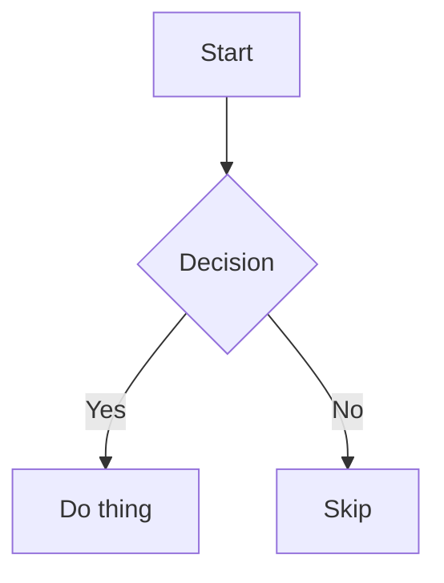

# MDReader sample document

A short document exercising every element the renderer supports, for manual QA and
Playwright screenshots.

## Text formatting

Plain text with **bold**, *italic*, ~~strikethrough~~, `inline code`, and a [link](https://example.com).
Here's a footnote reference[^1].

## Headings

### H3 heading
#### H4 heading
##### H5 heading
###### H6 heading

## Lists

- Unordered item one
- Unordered item two
  - Nested circle item
    - Nested square item

1. Ordered item one
2. Ordered item two
   1. Nested lower-alpha item
      1. Nested lower-roman item

- [x] Completed task
- [ ] Open task
  - [x] Nested completed task
  - [ ] Nested open task

## Blockquote

> A blockquote spanning
> multiple lines, to check quote background and border styling.

## Callouts

GitHub marker syntax:

> [!NOTE]
> Useful information the reader should notice.

> [!WARNING]
> Something that needs care.

The same cards via an `alt` attribute, for when the marker line is inconvenient:

<blockquote alt="info">

An `info` callout, equivalent to `[!NOTE]`.

</blockquote>

<blockquote alt="success">

A `success` callout, equivalent to `[!TIP]`.

</blockquote>

<blockquote alt="danger">

A `danger` callout, equivalent to `[!CAUTION]`.

</blockquote>

## Code

Inline `const x = 1` code, and fenced blocks in several languages — together these
exercise all twelve `--syn-*` tokens.

```js
// Comment: strings, numbers, template substitution
import { readFile } from 'node:fs/promises';

export class Greeter {
  #count = 0;

  async greet(name = 'world') {
    this.#count += 1;
    return `Hello, ${name}! (${this.#count})`;
  }
}

const re = /^[a-z]+$/i;
export default new Greeter();
```

```python
from dataclasses import dataclass

@dataclass
class Point:
    """A point in 2D space."""
    x: float = 0.0
    y: float = 0.0

    def norm(self) -> float:
        return (self.x ** 2 + self.y ** 2) ** 0.5

if __name__ == "__main__":
    print(Point(3, 4).norm())  # 5.0
```

```css
:root {
  --accent: #0969da;
}

article a:hover,
.callout::before {
  color: var(--accent);
  text-decoration: underline;
}
```

```html
<section class="wrapper" data-role="main">
  <!-- an HTML comment -->
  <h1 id="title">Hello</h1>
  <input type="text" disabled />
</section>
```

```bash
#!/usr/bin/env bash
set -euo pipefail

for f in *.md; do
  echo "processing ${f}"   # $$ here is a shell PID, not math
done
```

```json
{
  "name": "md-reader",
  "private": true,
  "version": "0.0.0",
  "scripts": { "dev": "vite" }
}
```

An untagged fence stays unhighlighted, since guessing the language does more harm
than good:

```
Just some plain text.
No language tag, so no coloring.
```

## Math

Display formulas use `$$…$$`. KaTeX loads only for documents that contain them.

$$
\int_0^1 x^2 \, dx = \frac{1}{3}
$$

Inline-style within a sentence: $$e^{i\pi} + 1 = 0$$ — Euler's identity.

A wider formula, to check that it scrolls inside its own block rather than
stretching the article:

$$
\hat{f}(\xi) = \int_{-\infty}^{\infty} f(x)\, e^{-2\pi i x \xi}\, dx \quad\text{where}\quad \xi \in \mathbb{R}
$$

Single dollar signs are left alone, so prices such as $5 and $10 stay literal text.

## Inline HTML

Press <kbd>Ctrl</kbd> + <kbd>P</kbd> to print, and <mark>highlighted text</mark>
marks a passage.

<details>
<summary>A collapsed section</summary>

Hidden until expanded — useful for long appendices.

</details>

## Mermaid diagram



### Invalid mermaid (error state)

```mermaid
not a real diagram type
some nonsense
```

## Table

A prose table — cells wrap instead of being forced onto one line, and even rows
carry the zebra tint:

| Tính năng | Mô tả |
| --- | --- |
| Cú pháp nổi bật | Tô màu mã nguồn theo từng ngôn ngữ, dùng mười hai token màu riêng biệt |
| Công thức toán | Dựng bằng KaTeX, chỉ tải khi tài liệu thật sự có công thức |
| Callout | Hai cú pháp, cùng một kiểu hiển thị |

Wide table to exercise horizontal scroll and edge-fade gradient:

| Column Alpha | Column Bravo | Column Charlie | Column Delta | Column Echo | Column Foxtrot | Column Golf | Column Hotel |
| --- | --- | --- | --- | --- | --- | --- | --- |
| Row one alpha value | Row one bravo value | Row one charlie value | Row one delta value | Row one echo value | Row one foxtrot value | Row one golf value | Row one hotel value |
| Row two alpha value | Row two bravo value | Row two charlie value | Row two delta value | Row two echo value | Row two foxtrot value | Row two golf value | Row two hotel value |

## Images

A working image:


A broken image (bad URL, exercises the fallback state):


## Horizontal rule

---

## Font tiếng Việt

Đoạn văn này dùng để kiểm tra cách font hiển thị tiếng Việt: dấu thanh chồng lên nguyên âm
đã có dấu phụ, những chữ dễ vỡ nét như **ữ**, **ỡ**, **ặ**, **ội**, **ườ**, và các chữ hoa
mang dấu như **Ổ**, **Ẫ**, **Ợ**. Nếu font thiếu glyph, chúng sẽ tụt dòng hoặc rơi về một
font dự phòng trông lệch hẳn so với phần chữ xung quanh.

Chiều cao dòng cũng cần đủ rộng: chữ tiếng Việt có dấu nằm cao hơn chữ Latin thông thường,
nên khi dòng quá sát nhau thì dấu của dòng dưới dễ chạm vào phần chân chữ của dòng trên.
Hãy thử kéo thanh *line height* trong phần tuỳ chỉnh để thấy khác biệt.

> [!TIP]
> Tiêu đề tiếng Việt vẫn tạo được liên kết neo đúng — mục lục bên phải trỏ tới
> `#font-tiếng-việt`, giữ nguyên dấu thay vì lược bỏ thành `font-ting-vit`.

Một câu dài không có chỗ ngắt hợp lệ, ví dụ đường dẫn
`https://example.com/tài-liệu/hướng-dẫn-cài-đặt-môi-trường-phát-triển`, sẽ tự xuống dòng
thay vì đẩy cả bài viết trượt ngang.

## Footnotes

[^1]: This is the footnote text, with a backlink to the reference above.
