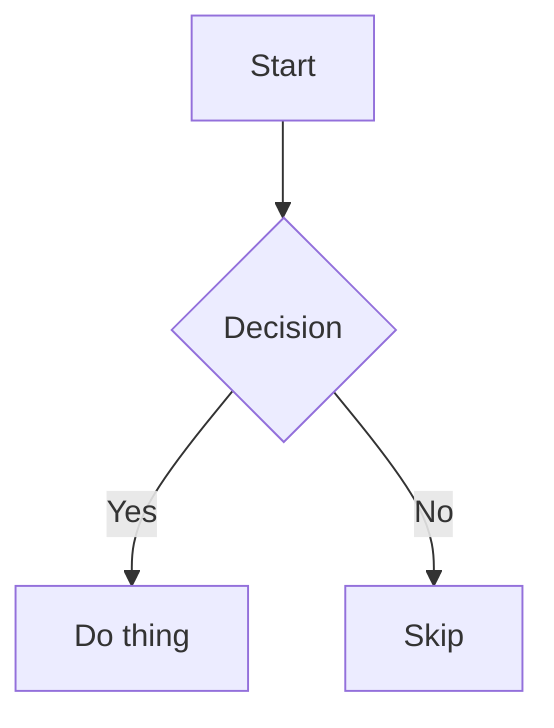

# MDReader sample document

A short document exercising every element the renderer supports, for manual QA and
Playwright screenshots.

## Text formatting

Plain text with **bold**, *italic*, ~~strikethrough~~, `inline code`, and a [link](https://example.com).
Here's a footnote reference[^1].

## Headings

### H3 heading
#### H4 heading
##### H5 heading
###### H6 heading

## Lists

- Unordered item one
- Unordered item two
  - Nested circle item
    - Nested square item

1. Ordered item one
2. Ordered item two
   1. Nested lower-alpha item
      1. Nested lower-roman item

- [x] Completed task
- [ ] Open task
  - [x] Nested completed task
  - [ ] Nested open task

## Blockquote

> A blockquote spanning
> multiple lines, to check quote background and border styling.

## Code

Inline `const x = 1` code, and a fenced block:

```js
function greet(name) {
  return `Hello, ${name}!`;
}
```

## Mermaid diagram



### Invalid mermaid (error state)

```mermaid
not a real diagram type
some nonsense
```

## Table

Wide table to exercise horizontal scroll and edge-fade gradient:

| Column Alpha | Column Bravo | Column Charlie | Column Delta | Column Echo | Column Foxtrot | Column Golf | Column Hotel |
| --- | --- | --- | --- | --- | --- | --- | --- |
| Row one alpha value | Row one bravo value | Row one charlie value | Row one delta value | Row one echo value | Row one foxtrot value | Row one golf value | Row one hotel value |
| Row two alpha value | Row two bravo value | Row two charlie value | Row two delta value | Row two echo value | Row two foxtrot value | Row two golf value | Row two hotel value |

## Images

A working image:


A broken image (bad URL, exercises the fallback state):


## Horizontal rule

---

## Footnotes

[^1]: This is the footnote text, with a backlink to the reference above.


# Giáo trình RAG — 14 ngày (Thầy dạy, bạn thực hành)

Đây là bản giảng đầy đủ đi kèm kế hoạch 2 tuần đã lên trước đó. Mỗi ngày gồm: mục tiêu, lý thuyết mình giảng trực tiếp, ví dụ minh họa, bài tập thực hành (code nằm ở thư mục `rag-project/`), và vài câu hỏi tự kiểm tra để bạn biết mình đã hiểu chưa trước khi qua ngày tiếp theo.